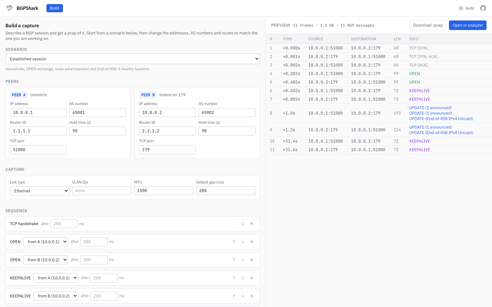
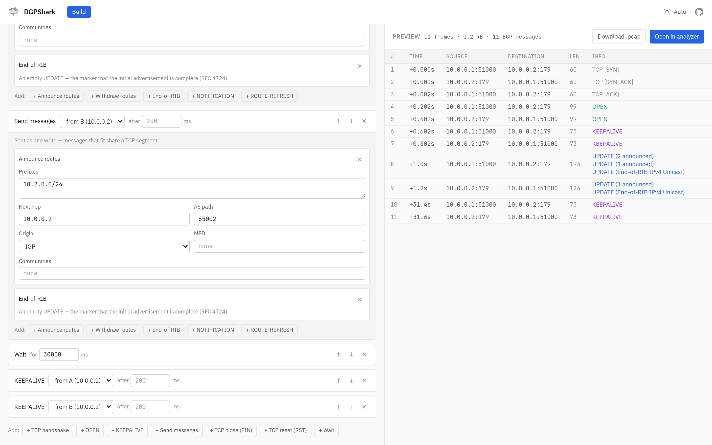

# 🦈 BGPShark

A browser-based pcap analyzer specialized for BGP session troubleshooting.
Inspect OPEN, UPDATE, NOTIFICATION, KEEPALIVE and ROUTE-REFRESH messages without
launching Wireshark.

**Everything runs in the browser** — the capture file is parsed locally and never
uploaded to a server.

## Features

- **pcap / pcapng** input, auto-detected. Ethernet and Linux SLL link types,
  802.1Q / QinQ tags stripped
- **Full BGP decode** — OPEN capabilities, UPDATE path attributes (AS_PATH,
  communities, large communities, MP_REACH/MP_UNREACH including IPv6 NLRI, …),
  NOTIFICATION error codes with troubleshooting hints
- **Dashboard** — message counts, severity-sorted alerts, neighbor table and a
  message timeline
- **Message Explorer** — packet list, hierarchical detail view, hex dump
- **Neighbor Analysis** — sessions grouped by Router ID with capability summaries
  and a side-by-side OPEN / capability diff
- **Route Analysis** — per-prefix announce / withdraw history and flap counts
- **SQL Console** — query the capture directly with DuckDB WASM
- **Export** — save the filtered packet list back out as a pcap, for attaching
  to a ticket or handing to a vendor
- **Capture builder** — describe a BGP session and get a pcap of it, without a
  lab. Eight starting scenarios (clean establishment, hold timer expiry, AS
  mismatch, TCP rejected, IPv6 transport, route flap, 4-byte AS, segmented
  UPDATEs), then edit the peers, routes and message sequence
- **Filter expressions** — `type = NOTIFICATION and src_ip = 10.0.0.1`, with
  autocomplete and a rule-builder mode. `src_port` / `dst_port` separate two TCP
  sessions between the same IP pair, and `frame` takes `<`, `<=`, `>`, `>=` for a
  frame range (`frame >= 100 and frame < 200`)
- Light / dark theme, following the system preference by default
- Loaded captures persist in IndexedDB and are restored on reload

## Getting started

Requires [Bun](https://bun.sh/).

```bash
bun install
bun run dev        # http://localhost:5173/bgpshark/
```

On Nix, `nix develop` gets you Bun, Node and a working Playwright browser in one
step — see [On Nix](#on-nix).

Other scripts:

```bash
bun test           # Run the parser test suite
bun run test:e2e   # Drive the app in a browser (see below)
bun run build      # Type-check and build to dist/
bun run preview    # Serve the production build
bun run lint       # ESLint
```

## Tests

`bun test` covers the parsers and the prefix arithmetic — everything under
`tests/lib`, with no browser involved.

`bun run test:e2e` drives the real app in Chromium against real DuckDB WASM.
That is the only place some of this app's failure modes are visible: SQL that
compiles but will not run, a route guard that redirects before the capture has
finished loading, a layout that only breaks below a breakpoint. The dev server
is started automatically. Specs live in `tests/e2e` and are named `*.e2e.ts`
rather than `*.spec.ts` so that `bun test` cannot pick them up.

```bash
bunx playwright install chromium    # once
bun run test:e2e
bun run test:e2e --ui               # pick through them interactively
bun run test:e2e layout             # one file
```

### On Nix

`flake.nix` provides a dev shell with Bun, Node and — on Linux — a Playwright
browser set that actually runs:

```bash
nix develop           # or `direnv allow`, using the .envrc
bun install
bun run dev
bun run test:e2e      # no `playwright install` step needed
```

The shell exports `PLAYWRIGHT_BROWSERS_PATH` at the nixpkgs browsers and skips
both the browser download during `bun install` and Playwright's host-requirement
check, which does not recognise a Nix system.

That matters because the browsers Playwright downloads are dynamically linked
against libraries a Nix system does not put where they expect, so they fail to
start. The nixpkgs build works, but only with the driver version it was built
for — so the nixpkgs revision in `flake.nix` and the `@playwright/test` pin in
`package.json` (1.61.1) are two halves of one decision. **Bump them together**:
point the flake input at a revision, check what it ships, and match the npm
package to it.

```bash
nix eval github:NixOS/nixpkgs/<rev>#playwright-driver.version   # what a revision ships
```

If they drift, `nix develop` warns on entry and Playwright later reports that it
cannot find a browser build it expects.

Without flakes, the older route still works:

```bash
export PLAYWRIGHT_BROWSERS_PATH=$(nix-build '<nixpkgs>' -A playwright-driver.browsers --no-out-link)
export PLAYWRIGHT_SKIP_VALIDATE_HOST_REQUIREMENTS=1
bun run test:e2e
```

(`nix-shell -p playwright-driver.browsers` is not enough on its own — it puts the
browsers in the store without pointing `PLAYWRIGHT_BROWSERS_PATH` at them.)

The flake stops at a dev shell: there is no package output, because nixpkgs has
no builder for a `bun.lock` and a from-scratch offline build would mean
maintaining a second, converted lockfile. `bun run build` inside the shell is
the build.

There is no committed `flake.lock` either — the one input is pinned to an exact
revision, so the shell is already reproducible without it. The lock Nix writes
on first use is yours to keep or delete.

## Filter syntax

```
type = OPEN
type = NOTIFICATION and src_ip = 10.0.0.1
src_ip = 10.0.0.1 or dst_ip = 10.0.0.1
asn = 65001
prefix = 10.0.0.0/8
community = 65000:100
capability contains "Route Refresh"
not (type = KEEPALIVE)
```

| Field | Matches |
|-------|---------|
| `type` | Message type (`OPEN`, `UPDATE`, `NOTIFICATION`, `KEEPALIVE`, `ROUTE_REFRESH`) |
| `src_ip` / `dst_ip` | Source / destination IP; a CIDR matches any address inside it |
| `router_id` | BGP Identifier from an OPEN message |
| `src_as` | AS number advertised in an OPEN message |
| `asn` | AS number appearing anywhere in AS_PATH |
| `origin` | `IGP` / `EGP` / `INCOMPLETE` |
| `next_hop` | NEXT_HOP or MP_REACH next hop |
| `prefix` | Announced or withdrawn NLRI prefix |
| `withdrawn` | Withdrawn prefix |
| `community` | Standard or large community |
| `capability` | Capability name from an OPEN message |

Aliases: `src`, `dst`, `as`, `aspath`, `nexthop`, `nlri`, `router-id`, `my_as`,
`large-community`.
Operators: `=`, `!=`, `contains`, `not contains`, combined with `and` / `or` / `not`
and parentheses.

Address and prefix fields compare numerically, not as text, and the mask is
honoured to the bit — `src_ip = 192.168.0.0/23` covers 192.168.0.0 through
192.168.1.255 and nothing else. For `prefix` and `withdrawn`:

- `prefix = 10.0.0.0/8` — routes **inside** 10.0.0.0/8, so 10.0.12.0/24 matches
- `prefix = 10.0.12.7` — routes that **cover** that address
- `prefix contains "10.0.1"` — substring search, for when you are still typing

The route analysis screen answers the same way, so a prefix that shows up there
also shows up in a filter using the same text.

## Architecture

```
pcap/pcapng → BGP parser → ┬→ React state (AppContext)
                           ├→ DuckDB WASM (SQL queries, filtering)
                           └→ IndexedDB (reload persistence)
```

Filter expressions are parsed once into an AST, then either evaluated in memory or
compiled to SQL depending on whether DuckDB initialized. If DuckDB is unavailable the
app still works, minus the SQL console.

| Path | Contents |
|------|----------|
| `src/lib/pcap/` | pcap and pcapng parsers, pcap writer, binary reader |
| `src/lib/bgp/` | BGP message and path attribute parsers, error hints |
| `src/lib/build/` | BGP message encoders, TCP/IP/Ethernet framing, scenario compiler |
| `src/lib/db/` | DuckDB schema, loader, queries, filter→SQL compiler |
| `src/lib/filter/` | Filter expression lexer, parser and evaluator |
| `src/lib/net/` | Prefix arithmetic shared by the filter, the DB and the UI |
| `src/pages/` | One component per route |
| `src/components/` | `common/`, `dashboard/`, `layout/`, `message/`, `neighbor/`, `sidebar/` |
| `testlab/` | ContainerLab topology for generating test captures |
| `docs/` | Design documents |

## Capture builder

The **Build** screen goes the other way: you describe a session and it writes the
pcap. It needs no capture loaded, which is the state you are in when you come
looking for one.



A scenario is two peers and a sequence of things that happen between them — the
TCP handshake, the OPEN exchange, some UPDATEs, a NOTIFICATION, a reset. Pick one
of the presets for the shape of the problem, then change the addresses, AS
numbers and routes to match the one in front of you. The preview is the built
file read back through the same parsers the analysis screens use, so what you see
there is what you will get.

Two things are decided from the scenario rather than asked for, because both are
consequences of it:

- **How UPDATEs are encoded.** AS number width and ADD-PATH Path Identifiers are
  negotiated in the OPENs, so they are derived from the two peers' capabilities.
  A capture whose OPENs and UPDATEs disagree is one no session could produce.
- **Where TCP segment boundaries fall.** Messages sent in one step are packed
  into a byte stream and cut at the MSS. Lowering the MTU is therefore how you
  build a capture whose BGP messages span segments.



The same thing is available as a library, which is the better route for
generating fixtures in bulk:

```ts
import { buildScenario, announce } from './src/lib/build'

const { bytes } = buildScenario({
  a: { ip: '10.0.0.1', as: 65001, routerId: '1.1.1.1' },
  b: { ip: '10.0.0.2', as: 65002, routerId: '2.2.2.2' },
  steps: [
    { kind: 'handshake' },
    { kind: 'open', from: 'a' },
    { kind: 'open', from: 'b' },
    { kind: 'keepalive', from: 'a' },
    { kind: 'keepalive', from: 'b' },
    {
      kind: 'send',
      from: 'a',
      messages: [announce(['10.1.0.0/24'], { nextHop: '10.0.0.1', asPath: [65001] })],
    },
    { kind: 'send', from: 'b', messages: [{ type: 'NOTIFICATION', errorCode: 6, errorSubcode: 2 }] },
  ],
})
```

Output is a real capture, not one only this app can read: IPv4 and TCP checksums
are computed properly over the pseudo-header, short frames are padded to
Ethernet's minimum, and `tests/lib/build/checksums.test.ts` verifies every built
frame the way a receiving stack would. Ethernet and Linux SLL, IPv4 and IPv6
transport, and VLAN/QinQ tagging are all available.

## Test lab

`testlab/` contains a ContainerLab topology of four SR Linux nodes (two ASes, iBGP
plus a full eBGP mesh) for producing realistic captures, including session flaps and
administrative shutdowns. See [testlab/README.md](testlab/README.md).

The builder covers the cases the lab makes awkward — a peer that never answers, a
specific NOTIFICATION subcode, a 576-byte MTU — while the lab produces the
traffic no description would think to include.

## Documentation

- [docs/design.md](docs/design.md) — requirements and technical design
- [docs/ui-design.md](docs/ui-design.md) — screen specifications
- [docs/design-duckdb-wasm.md](docs/design-duckdb-wasm.md) — the original DuckDB
  WASM migration proposal, kept for context; `design.md` describes what shipped
- [docs/todo.md](docs/todo.md) — log of fixed issues

## Deployment

Pull requests run lint, unit tests, build and the end-to-end suite via
`.github/workflows/ci.yml`. Pushes to `main` run the same checks and then deploy
to GitHub Pages via `.github/workflows/deploy.yml`. The app is served under the
`/bgpshark/` base path.

## Privacy

The app makes no third-party requests. Captures are parsed in the browser and stored
only in IndexedDB, and the DuckDB WASM runtime is self-hosted rather than loaded from
a CDN. The production build ships a Content Security Policy restricting every fetch
to the app's own origin.
